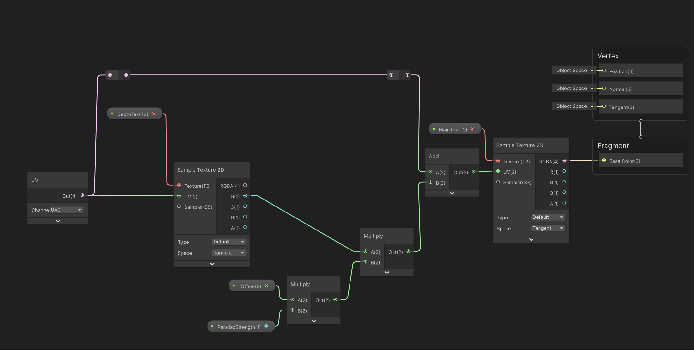
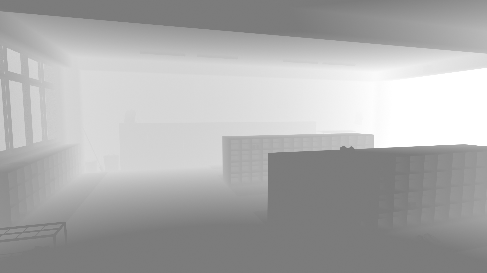

# Unity 2D Parallax

A lightweight, highly optimized 2.5D parallax background script for Unity. Perfect for VNs, 2D platformers, and UI menus. 
It smoothly shifts a `RawImage` material based on mouse movement or gamepad input, adding instant depth to the scene.

<video src="git_assets/res.mp4" width="100%" autoplay loop muted playsinline></video>

## Shader Graph

## Main Texture and Depth (Mist) Texture Example
<table>
  <tr>
    <td></td>
    <td></td>
  </tr>
</table>

## License
[Unlicense](https://unlicense.org/)